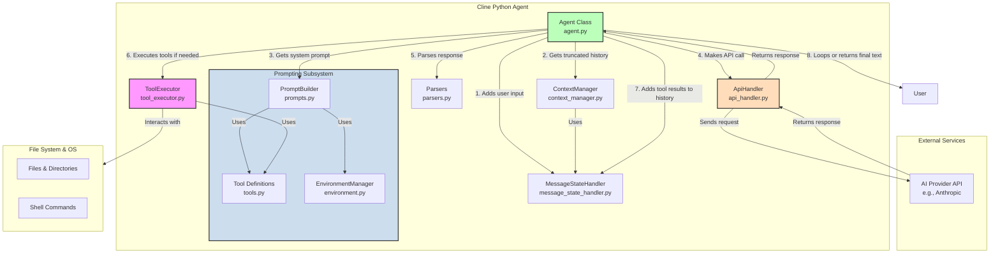

# Cline Agent Architecture & Development Guide

## Project Overview

The Cline Agent is a Python-based library that provides the core engine for AI-driven software development tasks. It is designed to be a self-contained, modular system that can be integrated into various environments. The agent follows a classic agentic loop: it receives an objective, communicates with an AI model, uses tools to interact with the environment, and continues until the objective is met.

## Architecture Overview

The agent is composed of several specialized components that work together to handle the complexities of an agentic workflow. The `Agent` class acts as the central orchestrator, coordinating the other components to execute tasks.



## Component Definitions

-   **Agent (`agent.py`)**: The central orchestrator of the system. It initializes all other components and manages the main agentic loop. It includes a **Plan/Act mode** to separate planning and execution. It takes user input, coordinates with the `ApiHandler` to get the AI's response, and uses the `ToolExecutor` to perform actions.

-   **ApiHandler (`api_handler.py`)**: Responsible for all communication with the external AI provider (e.g., Anthropic). It formats requests, sends them to the API, and returns the raw response to the `Agent`.

-   **ToolExecutor (`tool_executor.py`)**: Manages the execution of tools. It is initialized with a list of `Tool` objects and contains the implementation for each tool's logic. It provides a single interface (`execute_tool`) for the `Agent` to call them.

-   **ContextManager (`context_manager.py`)**: Prevents the conversation history from exceeding the AI model's context window limit. It uses a basic truncation strategy, preserving the most recent messages and the initial system prompt.

-   **MessageStateHandler (`message_state_handler.py`)**: Manages the state of the conversation. It maintains two separate histories: one for the user-facing conversation (`cline_messages`) and another for the full API conversation, including tool calls and results (`api_conversation_history`).

-   **Parsers (`parsers.py`)**: Contains functions for parsing the AI's text responses. Its primary role is to identify and extract tool usage requests (e.g., `<tool_code>` blocks) from the model's output.

-   **Prompts (`prompts.py`)**: Home of the `PromptBuilder` class, which is responsible for **dynamically constructing the system prompt**. It uses the structured definitions from `tools.py` and real-time context from `environment.py` to create a rich, context-aware prompt for the AI model.

-   **Tools (`tools.py`)**: Defines the **single source of truth for all available tools**. It contains structured classes (`Tool`, `ToolParameter`) that define each tool's name, description, and parameters. This provides a robust and maintainable way to manage the agent's capabilities.

-   **Environment (`environment.py`)**: Contains the `EnvironmentManager` class, which is responsible for gathering real-time information about the execution environment (e.g., Current Working Directory, Operating System, default shell).


## Agent Execution System

The core of the agent's functionality lies in the `step` method within the `Agent` class. This method implements the agentic loop that drives the conversation and task execution.

### Agent Execution Loop

The loop follows a clear, sequential pattern, now enhanced by the dynamic prompting subsystem:

```python
class Agent:
    def __init__(self, api_configuration):
        # ...
        self.tools = get_tools()
        self.tool_executor = ToolExecutor(self.tools)
        # ...

    def step(self, user_input):
        # 1. Add user input to conversation history
        # ...

        while True:
            # 2. Truncate history to fit the context window
            truncated_history = self.context_manager.get_truncated_conversation_history(...)
            
            # 3. Dynamically build the system prompt
            # The PromptBuilder uses the list of tools to construct the prompt
            system_prompt = get_system_prompt(self.mode, self.tools)

            # 4. Call the AI provider API
            assistant_response = self.api_handler.create_message(system_prompt, truncated_history)
            
            # 5. Parse the response for tool calls or text
            parsed_response = parse_assistant_message(assistant_response)

            # 6. Add the raw assistant response to the API history
            # ...

            # 7. Check if the response contains tool calls
            if parsed_response['type'] == 'tool_code':
                # 8a. Execute tool calls using the pre-initialized ToolExecutor
                tool_results = []
                for tool_call in parsed_response['tool_calls']:
                    tool_result = self.tool_executor.execute_tool(...)
                    tool_results.append(tool_result)
                
                # 8b. Add tool results to history and continue the loop
                # ...
            else:
                # 9. Return the final text and exit the loop
                # ...
```

## Tool Execution System

The new tool system is designed for robustness, clarity, and maintainability.

-   **Definition**: Tools are defined as structured objects in `tools.py` using the `Tool` and `ToolParameter` classes. This creates a single source of truth for a tool's name, description, and parameters.
-   **Registration**: The `ToolExecutor` is initialized with a list of `Tool` objects. It dynamically builds its dictionary of executable methods by mapping the tool names from the objects to its internal implementation methods (e.g., `_read_file`).
-   **Parsing**: The `parse_assistant_message` function in `parsers.py` uses regular expressions to find `<tool_code>` blocks and extract the tool name and input from the AI's response.
-   **Execution**: The `Agent` passes the extracted tool name and input to `ToolExecutor.execute_tool`, which looks up the tool in its dictionary and executes the corresponding method.

## Context Management

To avoid errors from exceeding the model's context window, the `ContextManager` implements a truncation strategy:

1.  **Token Counting**: It uses the `anthropic` client's `count_tokens` method to calculate the token size of the conversation.
2.  **Preservation**: It always preserves the first message (the system prompt) and the most recent messages.
3.  **Truncation**: When the token limit is approached, it removes messages from the middle of the conversation (the oldest messages after the system prompt) until the history fits within the `max_tokens` limit.

## Testing

The agent includes a suite of unit tests to ensure the reliability of each component.

-   **Test Runner (`run_tests.py`)**: A custom test runner script that sets up the necessary environment for testing. It mocks the `anthropic` library before any agent modules are imported, allowing the tests to run without requiring a live API key or network connection.
-   **Test Modules**: Each component has a corresponding test file (e.g., `test_agent.py`, `test_api_handler.py`) that contains unit tests for its specific functionality.
-   **Running Tests**: To run the entire test suite, execute the following command from the project's root directory:
    ```bash
    python -m agent.run_tests
    ```

## Conclusion

This guide provides a comprehensive overview of the Cline Python Agent's architecture. Its modular design, with clear separation of concerns, allows for easy maintenance and extensibility. By understanding the roles of each component and the flow of the agentic loop, developers can effectively contribute to and build upon this foundation.

## Contributing

Contributions to the Cline Agent are welcome. Please follow these guidelines:

-   **New Tools**: To add a new tool, first define its structure by creating a new `Tool` object in the `get_tools` function in `tools.py`. Then, implement the corresponding private method (e.g., `_new_tool_name`) in the `ToolExecutor` class.
-   **New API Providers**: To support a new AI provider, create a new handler class that conforms to the implicit interface used by `ApiHandler` and update the `ApiHandler` to allow for provider selection.
-   **Testing**: All new features or bug fixes should be accompanied by corresponding unit tests. Ensure that all tests pass by running `python -m agent.run_tests` before submitting changes.
-   **Documentation**: Keep this documentation up-to-date with any changes to the architecture or core functionality.
